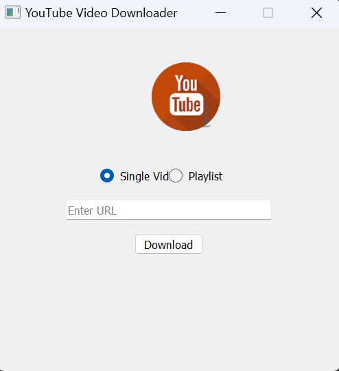

# YOUTUBE Videos Downloader tools


## screenshot



##### the tool used to create

- python
- PyQt5
- pytube

## You can customise

- Logo
- Full-screen
- Title

use the tool for your own project

---

### if you want to downloads the tool

- click on the code on "github" and Download zip
- or copy the git link and in your Terminal


```
git clone "git@github.com:Wolduur737/youtube-videos-downloader-using-python-and-pyqt5-and-more.git"
```
